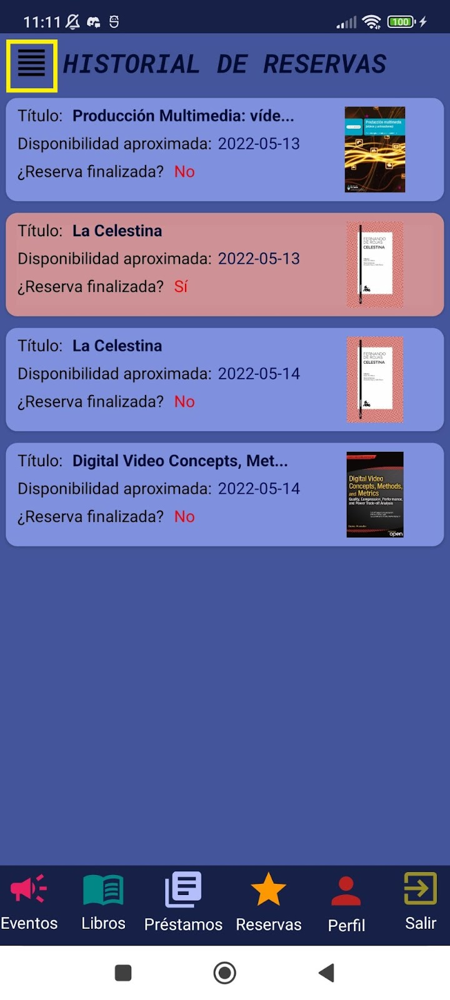
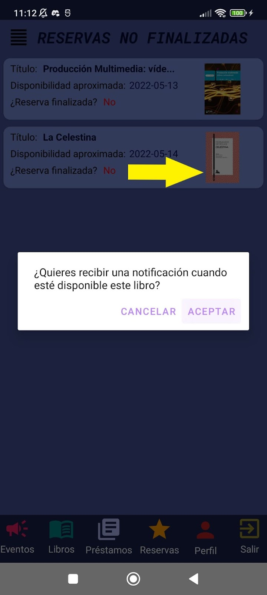
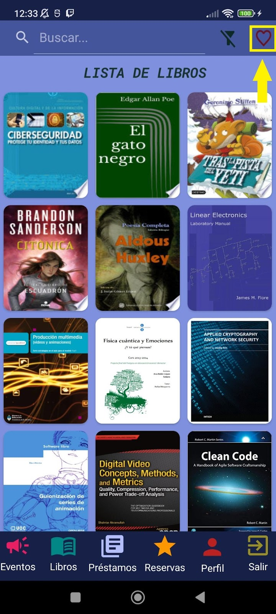

## 7.2. Aplicación de móvil

El siguiente manual es el de la aplicación de móvil. Nada más iniciarla, le saldrá el tablón de eventos con todos los eventos hechos y por hacer en la biblioteca.

Si pulsa un evento se abrirá una ventana desde la cual, podrá la descripción del evento con más detalle.

<table>
  <tr>
   <td>

   </td>
   <td>

   </td>
  </tr>
</table>

En la parte superior tiene un botón para abrir el calendario y mostrarle los eventos que se realizarán en la biblioteca el día que seleccione. Si selecciona un evento de la lista, se le abrirá una ventana con el evento para poder ver una descripción más completa.

<table>
  <tr>
   <td>

   </td>
   <td>

   </td>
   <td>

   </td>
  </tr>
</table>

A continuación pasaremos al apartado Libros del menú que tenemos en la parte inferior de la pantalla. En él, podremos ver todos los libros disponibles de la biblioteca. Si pulsa un libro, se abrirá una ventana para poder verlo en más detalle, consultar sus datos o consultar si está disponible para tomar en préstamo.

<table>
  <tr>
   <td>

   </td>
   <td>

   </td>
  </tr>
</table>

También podrá buscar cualquier libro desde la barra de búsqueda situada en la parte superior de la pantalla. Con ella podrá filtrar libros según quiera. A la derecha de la barra de búsqueda, tenemos un botón para filtrar según quiera, si no elige nada buscará cualquier coincidencia, si desea filtrar por autor, por ejemplo, buscará la coincidencia por autores. Para saber si la búsqueda de libros está siendo filtrada por algo, se puede fijar en el título de la lista o en el icono de filtrado, si está tachado significa que no está filtrando por nada en concreto.

<table>
  <tr>
   <td>

   </td>
   <td>

   </td>
   <td>

   </td>
  </tr>
</table>

Desde el apartado de información, podrá comunicarse con la biblioteca ya sea vía correo o llamando.

Si pulsa el apartado de socio, podrá ver que se le abre una ventana de login desde la cual los usuarios socios de la biblioteca podrán iniciar sesión para consultar sus datos o reservar libros.

<table>
  <tr>
   <td>

   </td>
   <td>

   </td>
   <td>

   </td>
  </tr>
</table>

Si los datos son correctos se deshabilitarán opciones para socios en el menú:

Veamos con más detalle cada apartado.

En el apartado de** Perfil **podrá ver los datos de su perfil de socio, pudiendo cambiar la contraseña, el correo electrónico, las categorías de interés y la foto de perfil. Desde este apartado también podrá comunicarse con la biblioteca.

Veamos primero el apartado de cambiar la contraseña. Si pulsa el texto en el que pone Cambiar contraseña, se le abrirá una ventana para confirmar los cambios y cambiar la contraseña a la que desee. Solo se cambiará la contraseña si el apartado de **contraseña actual **es correcto y si **nueva contraseña** y **confirmar contraseña **de contraseña nueva coinciden.

A continuación se muestra un ejemplo de cómo cambiar la contraseña de la que viene por defecto (el DNI) a 1234.

<table>
  <tr>
   <td>

   </td>
   <td>

   </td>
   <td>

   </td>
  </tr>
  <tr>
   <td>

   </td>
   <td>

   </td>
   <td>

   </td>
  </tr>
</table>

También podrá cambiar la imagen de perfil, el correo electrónico y las categorías favoritas si pulsa sobre ellos.

<table>
  <tr>
   <td>

   </td>
   <td>

   </td>
   <td>

   </td>
  </tr>
</table>

Pasemos al apartado de reservas, en este apartado podrá ver los libros que tiene reservados, así como el historial de reservas. También podrá eliminar reservas si desliza hacia la izquierda y añadir notificaciones si desliza a la derecha para que le avise cuando esté disponible.

<table>
  <tr>
   <td>

   </td>
   <td>

   </td>
   <td>

   </td>
  </tr>
</table>

<table>
  <tr>
   <td>

   </td>
   <td>

   </td>
   <td>

   </td>
  </tr>
</table>

El siguiente apartado es el de Préstamos, en este apartado podrá ver el historial de préstamos, los préstamos vigentes y podrá consultar en un calendario si tiene algún préstamo por devolver en la fecha seleccionada.

<table>
  <tr>
   <td>

   </td>
   <td>

   </td>
   <td>

   </td>
  </tr>
</table>

Por último, en el apartado de libros podrá ver que se ha desbloqueado un botón con forma de corazón. Si pulsa este botón, se mostrarán los libros que pertenecen a sus categorías de interés. Recuerda que puede cambiar en cualquier momento sus categorías de interés.

<table>
  <tr>
   <td>

   </td>
   <td>

   </td>
   <td>

   </td>
  </tr>
</table>

# 
